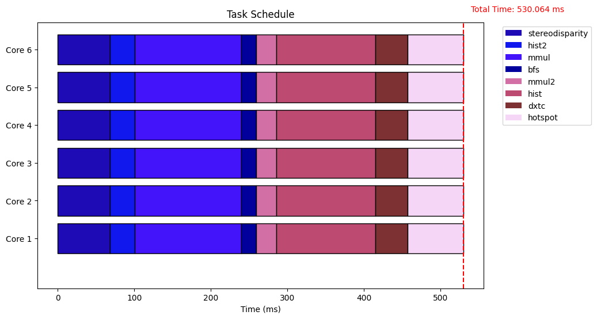
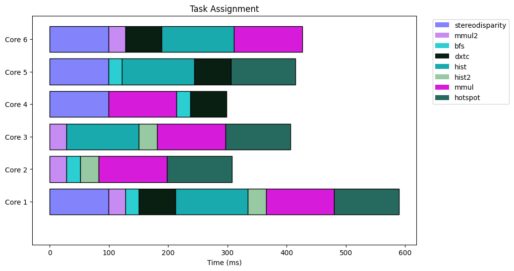
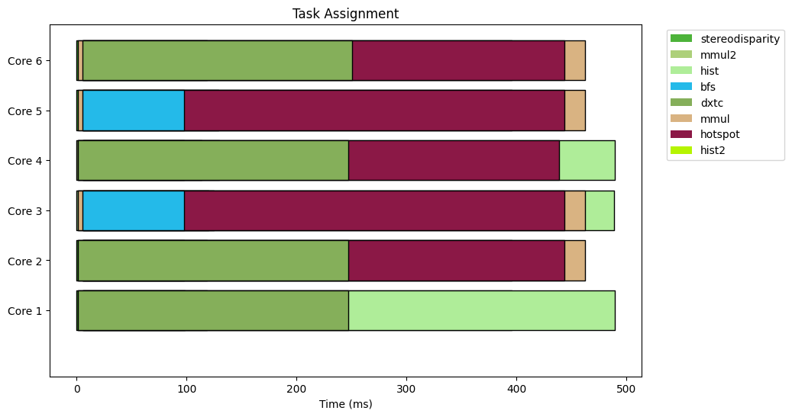
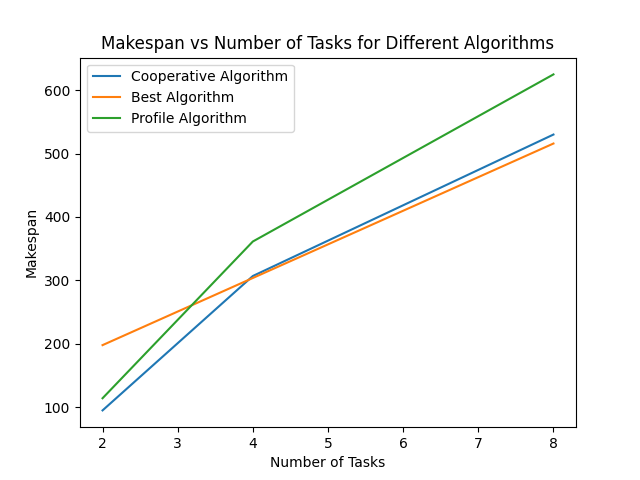
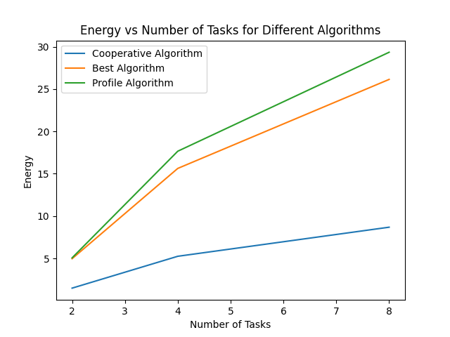

# Spatial Multitasking

This project implements and compares three spatial multitasking algorithms for scheduling tasks across multiple cores:
- **Cooperative Algorithm**: This baseline algorithm equally distributes tasks across available cores.
- **Best Algorithm**: Optimizes for makespan, energy consumption, and peak power, aiming to improve performance and resource utilization.
- **Profile Algorithm**: Maximizes the aggregated speedup for task execution across cores.

## Features
- **Task Scheduling Simulation**: Visual representation of task scheduling across cores for different multitasking algorithms.
- **Performance Metrics**: Comparison of makespan and energy consumption for various algorithms across increasing numbers of tasks.
- **Algorithm Efficiency**: Highlights the trade-offs between different algorithms with respect to energy and makespan performance.

## Plots
The following visualizations are generated by the project:

### Task Schedule
The plots below shows the distribution of tasks across six cores over time. Each color represents a different task, providing a clear overview of how tasks are scheduled and executed on each core.


**Figure 1:** Cooperative Algorithm


**Figure 2:** Best Algorithm


**Figure 3:** Profile Algorithm
### Makespan vs Number of Tasks
This plot shows the makespan (total time to complete all tasks) for different algorithms as the number of tasks increases. The Cooperative Algorithm has a lower makespan for fewer tasks, but the Best Algorithm becomes more efficient as tasks increase. The Profile Algorithm, although designed to maximize speedup.



### Energy vs Number of Tasks
This plot highlights the energy consumption for each algorithm as the number of tasks increases. The Cooperative Algorithm is more energy-efficient with fewer tasks, but the Best Algorithm demonstrates better energy optimization as task numbers rise.



## How to Run the Project
1. **Setup**: Ensure you have the necessary dependencies installed:
   - Python 3.x
   - `matplotlib` for plotting
   - `numpy` for numerical operations
   - Any additional libraries required for simulation (custom CUDA libraries if applicable)

2. **Run the Simulations**:
   Execute the simulation using the provided script to generate task schedules and analyze the performance of the three algorithms.

   ```bash
   python main.py
```
